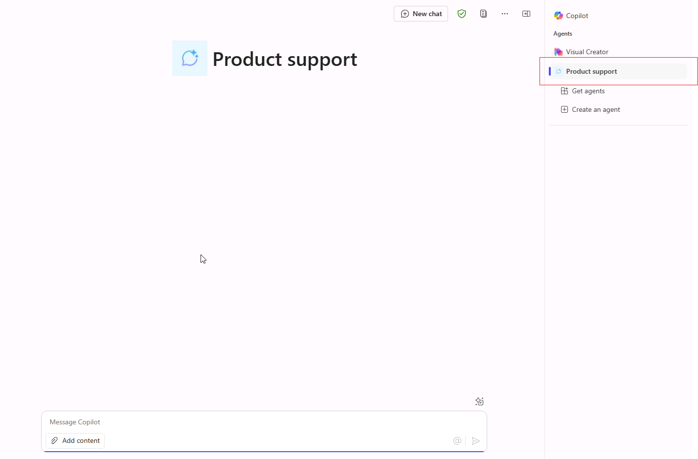
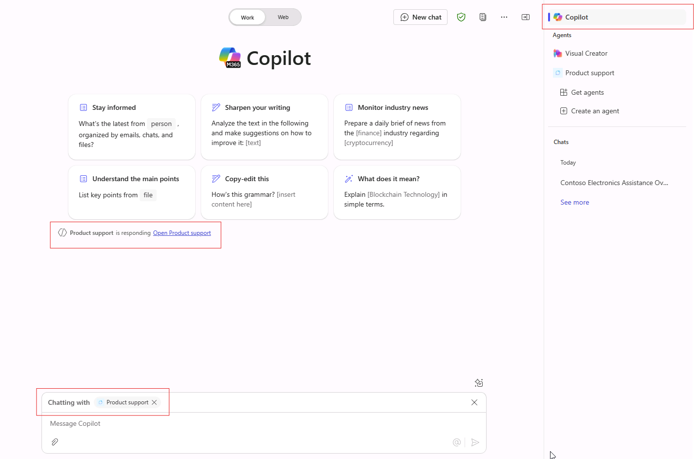

---
lab:
  title: '1.1: 선언적 에이전트 만들기'
---

# 선언적 에이전트 만들기

이 연습에서는 생성형 AI를 사용하여 선언적 에이전트를 만들고, 지침을 다듬고, Microsoft 365에 에이전트를 게시하고, Microsoft 365 Copilot에서 에이전트를 테스트합니다.

이 연습을 완료하는 데 약 **20**분 정도 소요됩니다.

## 생성형 AI를 사용하여 선언적 에이전트 만들기

Copilot Studio에서 새 선언적 에이전트를 만드는 것으로 시작합니다. 생성형 AI를 사용하여 에이전트에 대한 지침 및 속성의 초안을 작성합니다.

1. 웹 브라우저에서 [Microsoft Copilot Studio](https://copilotstudio.microsoft.com/)(`https://copilotstudio.microsoft.com`)로 이동합니다.
1. Copilot Studio에서 에이전트를 만들 권한이 있는 회사 또는 학교 계정을 사용하여 로그인합니다.
1. **Microsoft Copilot Studio 시작** 페이지에서 국가/지역을 선택하라는 메시지가 표시되면 선택한 다음 **시작**을 선택합니다.
1. **Copilot Studio에 오신 것을 환영합니다!** 라는 팝업이 표시되면 **건너뛰기**를 선택합니다.
1. Copilot Studio에 도달하면 새 에이전트를 만들기 위한 대화형 인터페이스에서 시작하게 될 것입니다. 이 마법사는 *사용자 지정* 에이전트를 설정하는 과정을 도와 줍니다.  **...** 를 선택한 다음 **에이전트 만들기 취소**를 선택하여 이 마법사를 종료합니다.  **종료**를 선택하여 확인합니다.

    

1. 왼쪽 탐색 패널에서 **에이전트**로 이동합니다.
1. 에이전트 페이지에서 **Microsoft 365 Copilot**을 선택합니다.
1. **Microsoft 365 Copilot** 에이전트 페이지의 에이전트 섹션 내 **추가**를 선택합니다.

    

    그러면 빌드하려는 에이전트를 설명할 수 있는 대화형 작성 환경으로 이동합니다.

1. 에이전트가 수행할 작업을 설명하라는 메시지가 표시됩니다.  대화형 인터페이스의 **메시지 입력** 텍스트 상자에 다음을 입력합니다.

    ```md
    I'd like to create a product support agent that answers questions related to Contoso Electronics products.
    ```

1. **입력** 또는 **보내기**를 선택하여 메시지를 보냅니다.
1. 에이전트 이름을 제시하라는 메시지가 표시되면 `Product support` 입력 후 메시지를 보냅니다.
1. 대화형 인터페이스 맨 위에서 **구성으로 건너뛰기**를 선택하여 에이전트의 개요 페이지를 보고 생성형 AI가 지금까지 구성한 내용을 검토합니다.

## 에이전트 구성 및 지침 정의

다음으로 에이전트의 속성 및 메타데이터를 수동으로 업데이트합니다.

1. 생성형 AI 마법사가 에이전트에 정의한 **이름**을 검토합니다. 이름을 업데이트하여 `Product support`이(가) 되도록 합니다.
1. **설명** 속성을 `A product support agent that can answer queries about Contoso Electronics products`(으)로 업데이트합니다.
1. **지침** 텍스트 상자에 다음을 입력합니다.
  
    ```md
        You are an agent tasked with answering questions about Contoso Electronics products. Start every response to the user with "Thanks for using a Copilot agent!\n\n" and then answer the questions and help the user.
    ```

1. 페이지 위쪽 **만들기**를 선택하여 에이전트를 만듭니다.  잠시 후 에이전트의 개요 페이지로 이동하게 됩니다.

## Copilot Studio에서 에이전트 테스트

다음으로, Microsoft 365 Copilot에 게시하기 전에 Copilot Studio 내의 테스트 창에서 에이전트의 동작을 테스트합니다.

1. **Product Support** 에이전트 개요 페이지의 **게시 세부 정보** 섹션에서 에이전트가 아직 게시되지 않은 것을 확인할 수 있습니다.

    

1. **에이전트 테스트** 창이 에이전트 개요 정보 오른쪽에 표시되지 않으면 게시 단추 옆에 있는 **테스트** 단추를 선택하여 테스트 창을 엽니다.
1. 텍스트 상자에 `What can you do?` 입력 후 메시지를 제출합니다.
1. 응답을 기다. 응답이 "Copilot 에이전트를 사용해 주셔서 감사합니다!"라는 텍스트로 시작하는 것을 확인합니다. 앞서 에이전트에 대해 정의한 지침에서 설명한 대로 적용됩니다.

    

    또한 에이전트에는 현재 지침이 있지만 아직 사용자 지정 지식 원본이나 작업이 없습니다. 아직 에이전트가 Contoso 제품에 대한 질문에 답변하도록 구성하지 않았습니다. 해당 작업은 다음 연습에서 수행합니다.

    > [!NOTE]
    > 에이전트를 편집해야 하는 경우 테스트 창을 닫고 에이전트 개요 페이지의 **세부 정보** 섹션에서 **편집**을 선택합니다. 다시 테스트하기 전에 테스트 창 내에서 **새로 고침** 단추를 선택하여 최신 변경 내용을 로드합니다.

## Microsoft 365 Copilot에 에이전트 게시

다음으로, 선언적 에이전트를 Microsoft 365 Copilot에 게시합니다. **Product Support** 에이전트 개요 페이지에서 다음을 수행합니다.

1. **게시** 단추를 선택합니다. Microsoft 365 Copilot 및 Microsoft Teams에서 사용자에게 표시될 에이전트에 대한 정보를 입력하라는 메시지가 표시됩니다.

    > [!NOTE]
    > 이 양식의 정보는 조직의 Office 및 Teams 카탈로그와 Microsoft 관리 센터 통합 앱 목록에 카탈로그 항목을 채우는 데 사용됩니다. Microsoft 365 Copilot 언어 모델에서 에이전트를 호출하는 데에는 사용되지 않습니다.

1. **짧은 설명** 텍스트 상자에 다음과 같이 입력합니다. `Answers questions about Contoso Electronics products` 
1. 나머지 필드에 대한 기본 제안을 수락합니다.
1. **게시**를 선택합니다.
1. 에이전트가 게시될 때까지 기다립니다.  게시하는 동안 모달 창을 닫으면 안 됩니다. 몇 분이 걸릴 수 있습니다.

    > [!NOTE]
    > 게시를 선택하면 에이전트에 해당하는 봇 리소스가 테넌트의 Microsoft Entra ID 환경에 프로비전됩니다. 이 리소스를 통해 사용자가 Microsoft Teams에서 에이전트와 상호 작용할 수 있습니다.

1. 에이전트가 게시되면 **가용성 옵션** 창이 나타납니다.
1. **공유 링크**에서 **복사**를 선택하여 에이전트의 공유 링크를 복사한 다음 **완료**를 선택합니다.
1. 에이전트 개요 페이지의 **게시 세부 정보** 섹션에 에이전트 게시 완료가 반영된 것을 확인합니다.

    

    공유 링크를 다시 복사해야 하는 경우 **게시 세부 정보** 섹션에서 **가용성 옵션**을 선택합니다.

1. 웹 브라우저에서 새 탭을 열고 공유 링크를 URL 표시줄에 붙여넣은 다음 **Enter** 키를 선택합니다. 에이전트의 개요가 있는 모달 창이 나타납니다. 게시하는 동안 에이전트에 대해 제공한 사용자 대면 정보와 에이전트에 필요한 사용 권한이 표시됩니다.

    

1. **추가**를 선택하여 Microsoft 365 Copilot에 에이전트를 추가합니다.
1. 에이전트가 추가될 때까지 기다립니다. 에이전트가 Microsoft 365 Copilot에서 시작됩니다.

## Microsoft 365 Copilot에서 에이전트 테스트

다음으로 Microsoft 365 Copilot에서 선언적 에이전트를 실행하고 **몰입형** 및 **컨텍스트** 환경 모두에서 기능을 확인해 보겠습니다.

이전 단계를 따른 결과 현재 **몰입형** 에이전트 환경에 있습니다. 채팅 인터페이스 측면의 **에이전트** 창에서 현재 채팅 중인 에이전트로 **Product Support**가 선택되어 있는지 확인합니다.



1. 텍스트 상자에 `What can you do?` 입력 후 메시지를 제출합니다.
1. 메시지를 보내고 응답을 기다립니다. 응답이 "질문해 주셔서 감사합니다!"라는 텍스트로 시작하는 것을 확인합니다. 에이전트의 지침에 제공한 안내에 따른 결과입니다.

브라우저에서 계속하여 **컨텍스트** 환경을 테스트해 보겠습니다.

1. 사이드바의 **에이전트** 창 위에서 **채팅** 또는 **M365 Copilot**을 선택하여 **Product Support** 에이전트와의 몰입형 채팅을 종료하고 Microsoft 365 Copilot과 채팅합니다.

    

1. 메시지 상자에 <kbd>@</kbd> 기호를 입력합니다. 플라이아웃은 사용 가능한 에이전트 목록과 함께 표시됩니다.

    

1. 플라이아웃에서 **제품 지원**를 선택합니다. 메시지 상자 위의 상태 메시지를 확인합니다. **제품 고객 지원팀과 채팅 중**이 표시되며, 이는 에이전트의 상황에 맞는 환경을 사용하고 있음을 의미합니다.

    

1. 텍스트 상자에 `What can you do?` 입력 후 메시지를 제출합니다.

1. 응답을 기다. 응답이 "질문해 주셔서 감사합니다!"라는 텍스트로 시작하는 것을 확인합니다. 에이전트의 지침에 제공한 안내에 따른 결과입니다.

1. 컨텍스트 환경을 종료하려면 상태 메시지에서 (X)를 선택합니다. 상태 메시지가 제거되고 더 이상 에이전트와 채팅하지 않음을 나타내는 메시지가 채팅 창에 표시됩니다.

    

이제 Microsoft 365 Copilot의 몰입형 환경과 컨텍스트 환경 모두에서 에이전트를 테스트했습니다.
