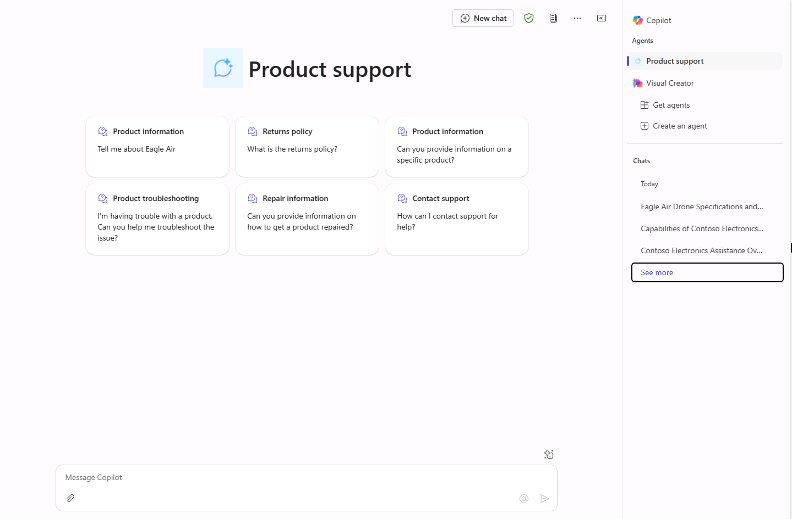

---
lab:
  title: '1.3: 스타터 프롬프트 추가'
---

# 스타터 프롬프트 추가

이 연습에서는 6개의 스타터 프롬프트를 사용하여 이전 연습에서 만든 선언적 에이전트를 업데이트합니다.

이 연습을 완료하는 데 약 **10**분 정도 소요됩니다.

## 스타터 프롬프트 정의

Copilot Studio에서 다음 작업을 수행합니다.

1. **Product Support** 에이전트의 **개요** 페이지로 이동합니다.
1. **스타터 프롬프트** 섹션에서 **편집**을 선택합니다.
1. 다음 6개의 스타터 프롬프트를 추가합니다.

      | 제목                  | Text                                              |
      |------------------------|--------------------------------------------------|
      | 제품 정보    | Eagle Air에 대해 알려줘                          |
      | 반품 정책         | 반품 정책이 뭐야?                      |
      | 제품 정보    | 특정 제품에 대한 정보를 알려줄 수 있어? |
      | 제품 문제 해결| 제품에 문제가 있어. 이 문제를 해결하도록 도와줄 수 있어? |
      | 수리 정보     | 제품을 수리하는 방법에 대한 정보를 알려줄 수 있어? |
      | 고객 지원 문의        | 지원을 받으려면 어떻게 해야 해?              |

1. 변경 내용을 **저장**합니다.

## 에이전트 다시 게시

업데이트한 에이전트를 Microsoft 365 Copilot에 게시해 보겠습니다.

1. Copilot Studio에서 에이전트 개요 페이지의 오른쪽 위에 있는 **게시**를 선택합니다.
2. 열리는 모달 창에서 **게시**를 선택합니다.
3. 열리는 **가용성 옵션** 창의 **공유 링크** 제목 아래에서 **복사**를 선택합니다.
4. 웹 브라우저의 다른 탭에서 에이전트의 공유 링크 **붙여넣기** 후 **Enter** 키를 선택합니다. **Product Support** 에이전트를 설명하는 창이 나타납니다.
5. 에이전트 이름 아래의 **지금 업데이트**를 선택하여 Product Support 에이전트에 변경 내용을 게시합니다. 에이전트가 업데이트되는 동안 잠시 기다립니다.
6. 업데이트가 완료되면 모달 창을 닫습니다. 브라우저에서 Microsoft 365 Copilot으로 이동하지 않는 경우 왼쪽 메뉴 또는 Microsoft 365 포털의 **앱** 메뉴에서 **Copilot**을 선택합니다.

## Microsoft 365 Copilot에서 에이전트 테스트

1. **Microsoft 365 Copilot**에서 오른쪽 상단의 아이콘을 선택하여 **Copilot 가로 패널 확장**으로 이동합니다.
2. 에이전트 목록에서 **제품 지원**을 찾아서 선택하면 몰입형 환경으로 들어가 에이전트와 직접 채팅할 수 있습니다. Copilot Studio에서 정의한 스타터 프롬프트가 사용자 인터페이스에 표시됩니다.

    
3. 스타터 프롬프트를 **선택**하고 응답을 검토합니다.
