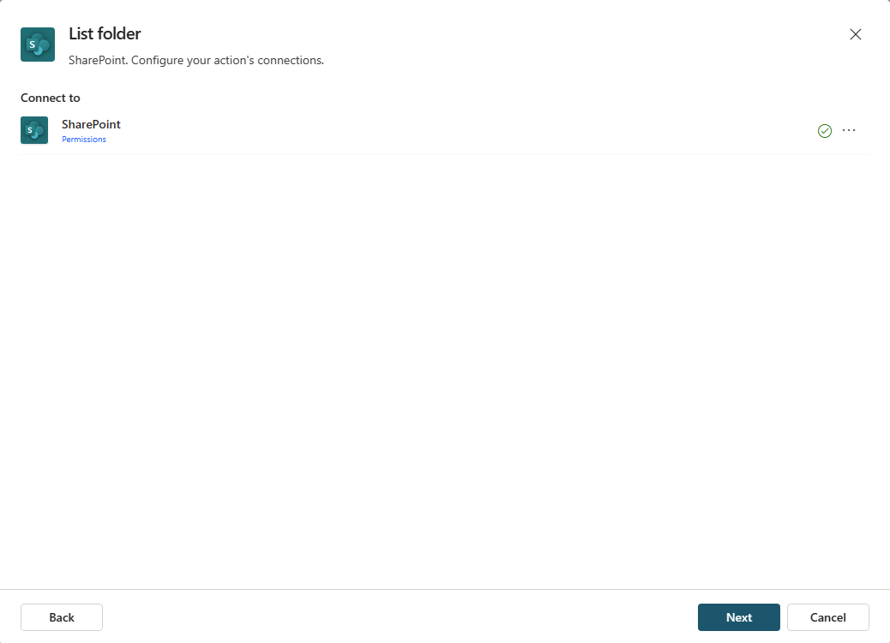

---
lab:
  title: '3.1: 커넥터 작업 만들기'
---

# 커넥터 작업 만들기

이 연습에서는 Copilot Studio에서 선언적 에이전트에 대한 커넥터 작업을 구성합니다. "SharePoint - 목록 폴더" 커넥터를 사용하여 제품 지원 파일이 포함된 Products 폴더에서 파일 목록을 검색합니다.

이 연습을 완료하는 데 약 **15**분 정도 소요됩니다.

## 시작하기 전에

이 연습에서는 기존 에이전트에 커넥터 작업을 추가하는 데 중점을 둡니다. 이 연습에서는 다음을 가정합니다.

1. Copilot Studio에서 **Product Support** 선언적 에이전트를 이미 만들었습니다. 선언적 에이전트를 만들기 위한 지침이 필요한 경우 [선언적 에이전트 만들기](../01-Build-your-first-declarative-agent/01-create-declarative-agent.md)를 참조하세요.
1. **Product Support**라는 이름의 SharePoint 사이트가 있고, 이 사이트에는 샘플 제품 관련 데이터가 있는 파일이 들어 있는 **Products**라는 문서 라이브러리가 있습니다. 지침은 [사용자 지정 지식 추가](../01-Build-your-first-declarative-agent/02-add-custom-knowledge.md) 연습 내에 있는 **시작하기 전에**라는 섹션을 참조하세요.

## SharePoint 커넥터 작업 만들기

1. 웹 브라우저에서 [Copilot Studio](https://www.copilotstudio.microsoft.com)(`https://www.copilotstudio.microsoft.com`)로 이동합니다.
1. **라이브러리**에서 **Product Support** 에이전트를 선택합니다.
1. **작업**에서 **작업 추가**를 선택합니다.
1. **작업 추가** 창에서 **검색 창**에 `SharePoint`을(를) 입력합니다. 관련 작업이 창에 표시될 때까지 기다립니다.
1. **목록 폴더 SharePoint** 커넥터 작업을 찾아 선택합니다.
1. 모달 창에 SharePoint 커넥터에 대한 연결이 표시됩니다. 연결이 활성화되면 커넥터 옆에 녹색 확인 표시가 표시됩니다. **...** 를 선택하면 연결에 대한 세부 정보를 확인할 수 있습니다.
    
1. 연결이 활성화되면 **다음**을 선택합니다. 작업의 속성을 구성하기 위해 **목록 폴더** 페이지로 이동하게 됩니다.
1. **이름** 텍스트 상자에 `List product support files`을 입력합니다.
1. **설명** 텍스트 상자에 `List product support files available in the Products folder`을(를) 입력합니다.
1. **최종 사용자 인증**이 **사용자 인증**으로 설정되었는지 확인합니다.
1. **입력 및 출력** 섹션을 펼칩니다.
1. **사이트 주소** 입력을 선택합니다.
1. **값** 텍스트 상자에 **Product Support** SharePoint 사이트의 URL을 `https://DOMAIN.sharepoint.com/sites/ProductSupport` 형식으로 입력한 다음 **완료**를 선택합니다.
1. **파일 식별자** 입력을 선택합니다.
1. **에이전트가 이 입력을 채우는 방법**을 드롭다운을 통해 **값으로 설정**으로 설정한 다음 **확인**을 선택합니다.
1. **값** 텍스트 상자에 `Products` 입력 후 **완료**를 선택합니다.
1. **작업 추가** 단추를 선택하고 SharePoint 작업이 에이전트에 추가될 때까지 기다립니다. 이제 에이전트 세부 정보 페이지의 **작업** 섹션에 작업이 표시되어 있어야 합니다.

## 작업 구성

1. **작업** 섹션에서 **List product support files** 작업을 선택하여 세부 정보 페이지를 엽니다.
1. **출력** 탭으로 이동합니다.
1. 테스트를 위해 **이 작업의 결과가 표시되는 방법 선택**에서 **작업 실행 직후 메시지 보내기**라는 레이블이 지정된 확인란을 선택합니다. 추가 구성 옵션이 표시됩니다.
1. **사용자에게 정보를 표시하는 방식** 아래에서 드롭다운을 선택한 다음 **메시지 만들기**를 선택합니다. 텍스트 상자가 표시됩니다.
1. **표시할 메시지** 텍스트 상자에 `You used the SharePoint connector` 입력 후 페이지 위쪽 **저장**을 선택합니다.

## 에이전트의 지침 수정

커넥터 작업을 사용하기 위한 안내를 제공하는 에이전트의 지침도 업데이트해 보겠습니다.

1. **Product Support** 에이전트의 **세부 정보** 섹션에서 **편집**을 선택합니다.
1. **지침** 텍스트 상자에서 기존 명령 텍스트에 다음을 추가합니다. `When asked about available support resources, use the SharePoint connector to list the files in the Products folder.` 
1. **저장**을 선택합니다.

## 작업으로 에이전트 테스트

1. 에이전트 세부 정보 페이지의 오른쪽에 있는 **에이전트 테스트** 창을 펼칩니다.
1. 테스트 창에서 **새로 고침** 단추를 선택하여 에이전트의 최신 변경 내용을 로드합니다.
1. 메시지 상자에 `What product support files are available?` 입력 후 메시지를 보냅니다.
1. 에이전트가 "You used the SharePoint connector"라는 메시지로 응답한 다음 Products 폴더에서 사용할 수 있는 파일 목록을 제공합니다.

커넥터 작업이 에이전트 내에서 예상대로 작동하는지 확인했습니다.
